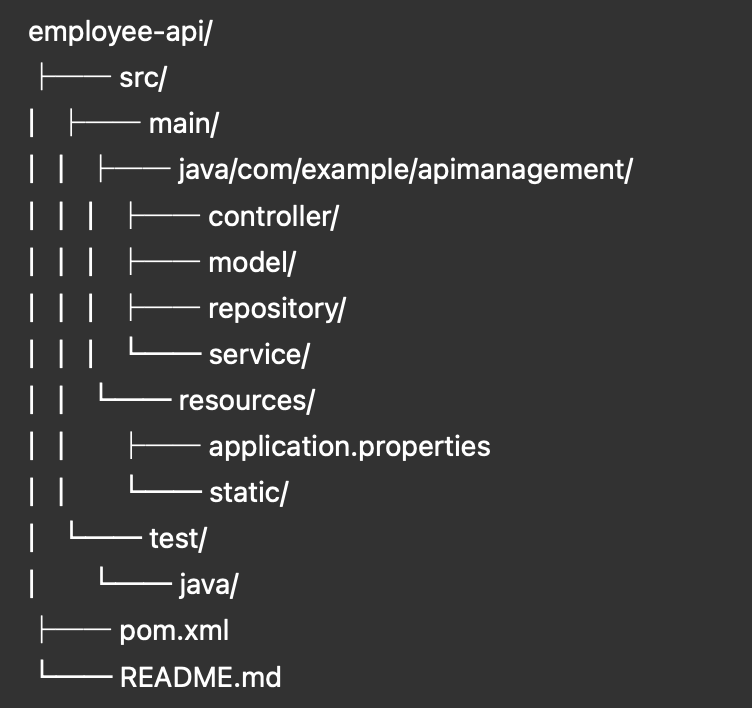

# 🧑‍💼 Employee Management REST API

A simple and practical **RESTful API** for managing employees, built with **Spring Boot**.  
This project demonstrates how to develop a clean and maintainable backend service using modern Java frameworks and tools.

---

## 🚀 Features

✅ Build RESTful APIs with Spring Boot  
✅ Perform CRUD operations on Employee data  
✅ Use **Spring Data JPA** for seamless database integration  
✅ Validate input using `spring-boot-starter-validation`  
✅ Leverage an **in-memory H2 database** for development  
✅ Containerize the app with **Docker**

---

## 🧰 Tech Stack

| Layer | Technology |
|-------|-------------|
| Language | Java 17+ |
| Framework | Spring Boot |
| ORM | Spring Data JPA / Hibernate |
| Database | H2 (In-memory) |
| Build Tool | Maven |
| Containerization | Docker |
| Validation | Jakarta Validation / Hibernate Validator |

---

## 🧩 Project Structure

---

## ⚙️ Prerequisites

Before running this project, make sure you have:

- ☕ **Java 17** or later
- 🧱 **Maven 3.8+**
- 🐳 **Docker** (optional, for containerization)

---

## 🏃‍♂️ How to Run Locally

1. **Clone the repository:**

```bash
git clone <your-repository-url>
```
2. Build the project
````
   mvn clean install
   ````
3. Run the application

````
./mvnw spring-boot:run
````
## 🐳 Running with Docker
````
docker build -t employee-api .
docker run -p 8080:8080 employee-api
````
## 🌐 API Endpoints
````
http://localhost:8080/api/employees
````